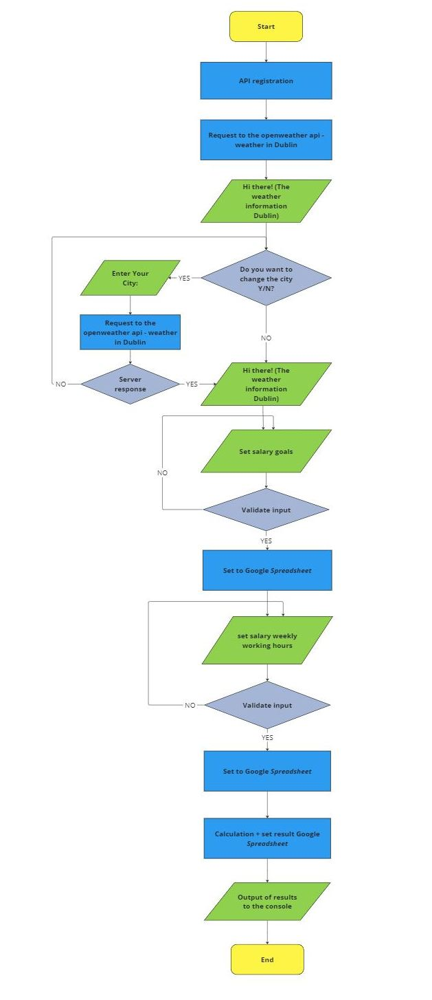
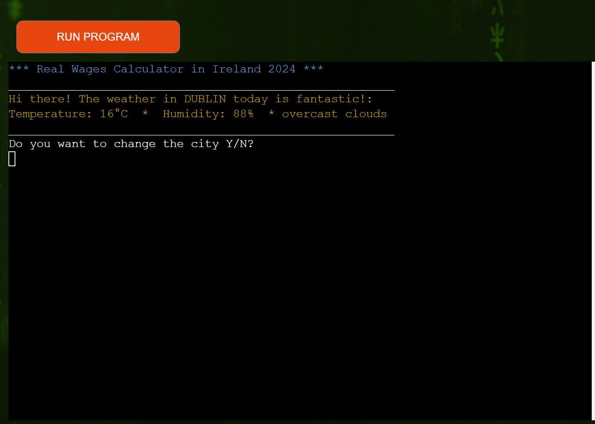
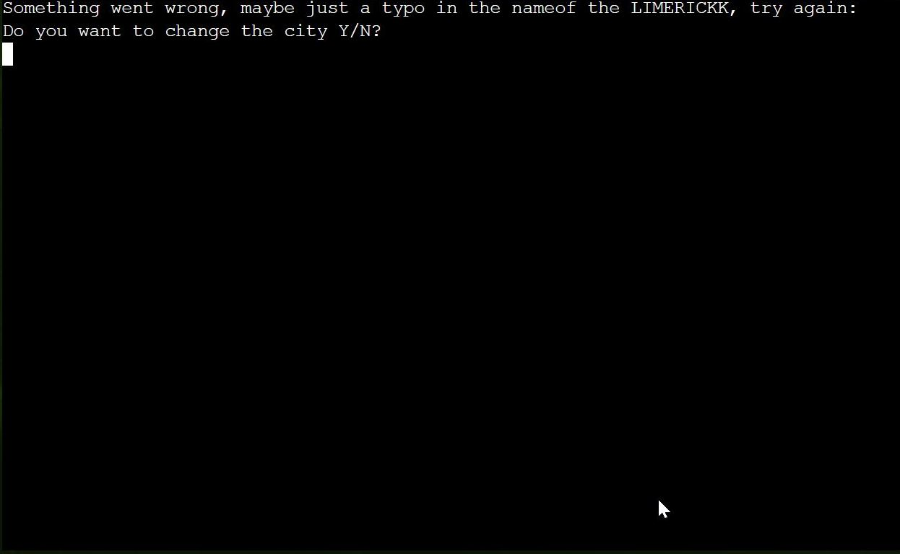
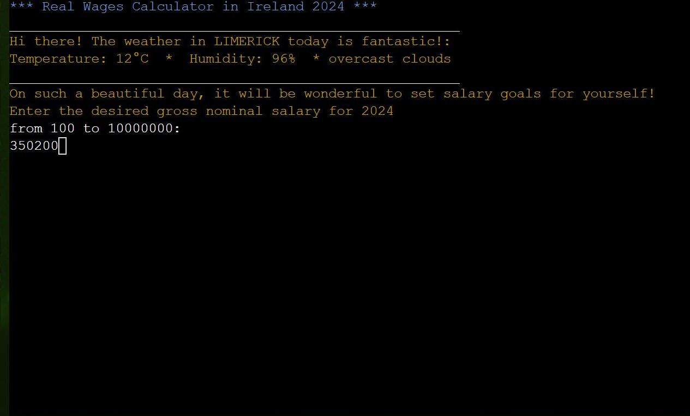
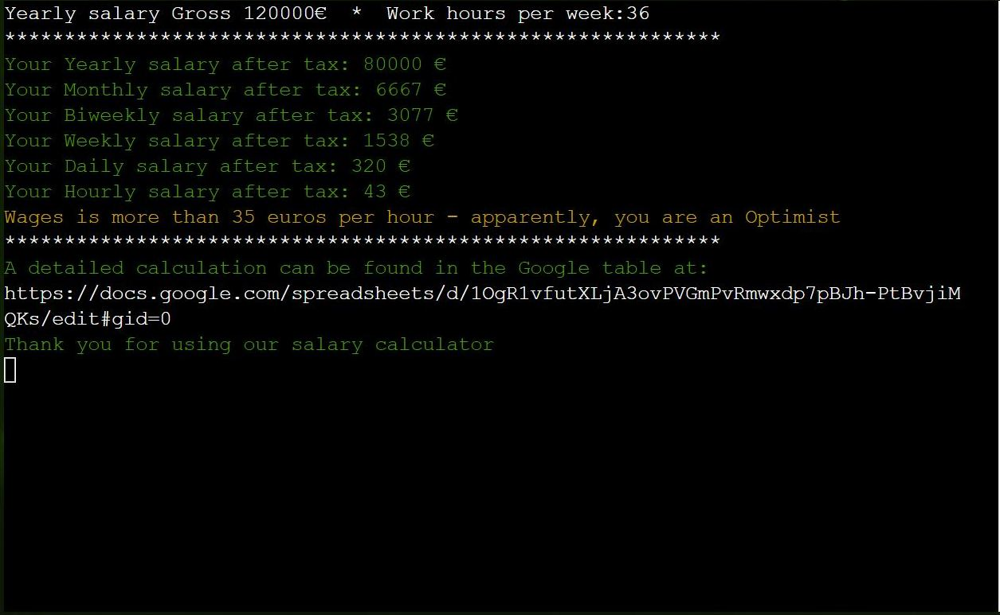

# Personal Real Wages Calculator Ireland 2024


[Link to Website](https://salary-calculator-pp3-2e2cf7e2142c.herokuapp.com/)

[GitHub Repo](https://github.com/app-wizard/python_api_pp3)

## Index - Table of Contents

* [Real Wages Calculator in Ireland 2024]
* [About](#about)
* [Index - Table of Contents](#index---table-of-contents)
* [User Experience Research and Design](#user-experience-research-and-design)
    * [Strategy](#strategy)
    * [Scope](#scope)
    * [Structure](#structure)
    * [Skeleton](#skeleton)
* [Features](#features)
    * [Current Features](#current-features)
    * [Future Features](#future-features)
* [Technologies Used](#technologies-used)
    * [Languages Used](#languages-used)
    * [Tools](#tools)
* [Testing](#testing)
    * [Functionality](#functionality)
    * [Validators](#validators)
* [Deployment](#deployment)
    * [How to clone the GitHub repository](#how-to-clone-the-github-repository)
    * [How to fork the GitHub repository](#how-to-fork-the-github-repository)
    * [Deploy with Heroku](#deploy-with-heroku)
* [Credit](#credit)
    * [People](#people)
    * [Python Library Dependecies and Packages](#python-library-dependecies-and-packages)
    * [Software & Web Applications](#software--web-applications)
* [Aknowlodgements](#aknowlodgements)

## About

This console application is designed to assist users in estimating their actual hourly, weekly, and monthly wages. Often, job listings only mention the annual gross salary. By knowing the expected weekly work hours, users can calculate the information they need. The program also consider taxes, applying a 20% rate before reaching a certain income threshold and 40% after. Users can specify this threshold in a designated cell on a Google spreadsheet. Additionally, the application starts with an icebreaker, displaying current weather information for the option to change the city and receive corresponding weather updates.

## User Experience Research and Design

### Strategy

* Reasons a user may want to visit the website

    - Determine real wage across distinct time frames based on annual income and weekly working hours.

    - Get weather information quickly.

* Reasons for the website owner

    - The opportunity to earn income from considering a job change by including targeted advertising for websites or companies looking for new employees, which will allow them to reach the desired audience directly.

    - The ability to additionally place links to sites with vacancies receiving income from redirecting traffic.

### Scope

* What a user may want:

    - A simple interface with the ability to quickly get answers to his questions.

    - Clear program reactions to incorrect input of information.

    - The possibility to restart the program at any time.

    - Gain the option to display the calculation on the console and an extra option to either print or save a table containing the result.

* As a developer what I expect

    - The user will be satisfied with the speed and ease of operation of the program with clear concise queries.

    - Code with comprehensive comments to facilitate straightforward maintenance.

### Structure

The program's logical framework was conceived and charted as an algorithm. Every user action undergoes validation, and only when the information is confirmed as valid does the program progress to the subsequent step.

Below, you'll find the game's underlying logic represented in the form of a flowchart, created using the online service miro.com.



### Skeleton

The application has been designed with a user-friendly visual layout, even though it runs in the terminal. It employs various colors to distinguish user prompts from other information and the ensuing output. Moreover, each message is followed by a newline to maintain a clean and uncluttered display. Additionally, the screen is cleared before displaying results to enhance user presentation.


## Features

### Current Features

- The Main screen greets the user and as an icebreaker displays information about the current weather in the city of Dublin (this city is specified by default) then the user is asked to leave everything as it is or change the city to display the weather

 

If the user consent to changing the city, they will be prompted to input the city's name. The name will be converted to uppercase and sent as an API request to the OpenWeather server. Only upon receiving a valid response from the server can the next step be initiated.


If there is a typo in the name of the city, the user will be asked to try again or not to change the city and continue with the default option (Dublin)



When the city is chosen correctly, the API will provide weather information for the selected city. Behind the scenes, we will obtain an API response in the form of an object, which we will later parse to extract necessary data such as temperature, humidity, and a general weather description using Python's f-strings. We will then display this information on the console, converting the temperature from Kelvin to degrees Celsius to ensure it is presented in a user-friendly format.


In the subsequent step, the program will request input regarding the annual salary. The validator will verify that the user's input falls within the specified numeric range. Only when the input is accurate will advancement to the next step be permitted. In the event of incorrect input, an error message will be shown, and the user will be prompted to provide the information again.



In the following step, the program will request the user to input the anticipated number of weekly working hours. Validation will only permit progression to the subsequent step if the user enters a number within the specified range. If the input falls outside this range, the user will be prompted to provide the correct information.


Once the user has provided the requested information, the program will perform essential calculations using the following criteria:

 - Calculations rely on the premise of 250 working days in 2024 and 52 working weeks in the year.

 - Tax calculations are made with the assumption of a 20% rate before reaching the tax threshold, and a 40% rate thereafter. Additional conditions are not factored into the calculation.

The program will display the result on the console. Furthermore, it will provide a link to a Google spreadsheet containing more comprehensive information. Through this Google spreadsheet, users can save or print the information in a well-formatted manner.



```
In this version, the program operates as a Minimum Viable Product (MVP) and relies on a single Google spreadsheet. This limitation may result in inaccurate information display if multiple users utilize the application simultaneously. Therefore, at this stage, the application is designed for individual use only. The subsequent section will provide a more detailed description of the steps required to launch a commercial project.
```

### Future Features

- We can enhance calculation accuracy by collaborating with accounting specialists to create tax calculation algorithms.

- Consider using a relational database to store calculated parameters either as a replacement for Google Sheets, or in combination with them. In addition, you can explore the possibility of integrating online services such as Firebase or AWS to extend functionality.

- To display information to the user in a more modern graphical form, use the Python application as a backend system. To interact with the user, develop a frontend system such as a website or a mobile application.

## Technologies Used

### Languages Used

* [Python 3.8.12](https://www.python.org/)
* [Node.js](https://nodejs.org/en)
* [HTML] (Limited use for terminal output inside the web interface)
* [CSS] (Limited use for terminal output inside the web interface)

### Tools

* [Git](https://git-scm.com): Employed for version control, utilizing the Gitpod terminal for commits and pushing changes to GitHub.

* [GitHub](https://github.com): Served as the project's code repository once it was pushed from Git.

* [Heroku](https://www.heroku.com): Utilized for application deployment, providing an execution environment for the code.

* [PEP8](https://pep8ci.herokuapp.com/): Employed to validate code compliance with requirements.

* [Miro](https://www.miro.com): Utilized for crafting the game's flowchart.

* [Weather_API] (https://openweathermap.org/api): Current Weather Data API

* [Google_API] (https://console.cloud.google.com/apis/library): Connecting and working with Google tables in the project

## Testing

### Functionality


### Validators

The [PEP8](https://pep8ci.herokuapp.com/) validator was used to check if the code in the run.py has any problem.

The test result is: "All clear, no errors found"


## Deployment

### How to clone the GitHub repository

1. Navigate to the repository on GitHub by visiting https://github.com/app-wizard/python_api_pp3

2. Click on the 'Code' button to reveal a dropdown menu.

3. Select 'HTTPS' and then copy the provided URL.

4. Open your Gitbash terminal.

5. Change your current working directory to the location where you intend to clone the directory.

6. Enter the command git clone, followed by pasting the URL you copied earlier. Press Enter to initiate the cloning process.

7. To push any local changes back to the repository, follow these steps:

        a. Make the necessary updates to the code.
        b. In your terminal, execute the command git add . (or specify the filename).
        c. Input git commit -m "brief description of the change".
        d. Finally, execute git push.

### How to fork the GitHub repository

1. Visit the GitHub repository at https://github.com/app-wizard/python_api_pp3.

2. Click on the 'Code' button to reveal a drop-down menu.

3. Choose 'HTTPS' and copy the provided URL.

4. Open your Gitbash terminal.

5. Change your current working directory to your desired location for cloning.

6. Use the command git clone followed by pasting the copied URL, and press Enter to initiate the cloning process.

7. If you need to push local changes to the repository, follow these steps:


### Deploy with Heroku

The deployments are donde manually from the terminal.

Before you begin, make sure you have the following:

- Python installed on your local machine.
- Heroku CLI (Command Line Interface) installed.
- A Heroku account (create one if you haven't already at [Heroku Signup](https://signup.heroku.com/)).

**If you are creating a new deployment/app**

- Run the command `heroku login -i ` and login with email and password when prompted. Then run the command `heroku create your_app_name_here` to create a new app, replacing `your_app_name_here` with the name you want to give to your app. This will create a new Heroku app and link it to your Gitpod terminal. You can access the app via the Heroku dashboard and set up your config vars.

**If you already have an app created which uses automatic deploys.**

- Run the command `heroku login -i` and login with the email and password when prompted. Then run the following command: `heroku git:remote -a your_app_name_here` and replace `your_app_name_here` with the name of your Heroku app. This will link the app to your Gitpod terminal.

Once you have followed the appropriate step above, your Heroku app will be linked to your workspace.

## Credit

* Mentor support, guidance, and tips to improve my coding skills throughout the project:

    - Brian Macharia

* Checking code information (syntax and uses):

    - https://www.w3schools.com/python/

    - https://openweathermap.org/current
    
    - https://stackoverflow.com/


## Aknowlodgements

This game was built as my third project for [Code Institute](https://codeinstitute.net/global/).